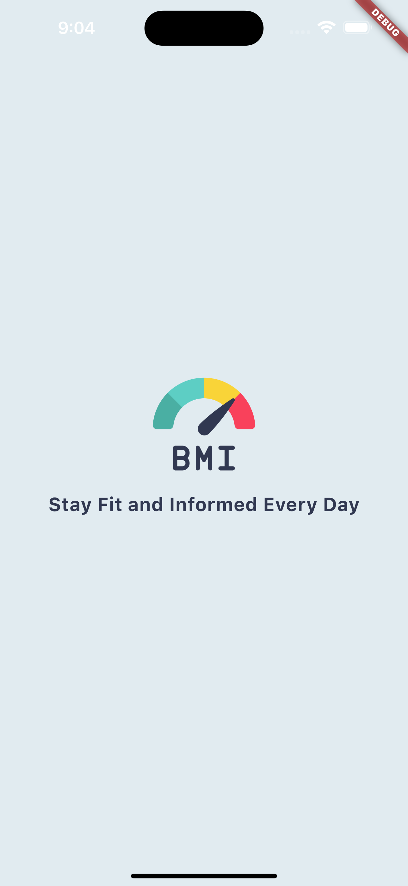
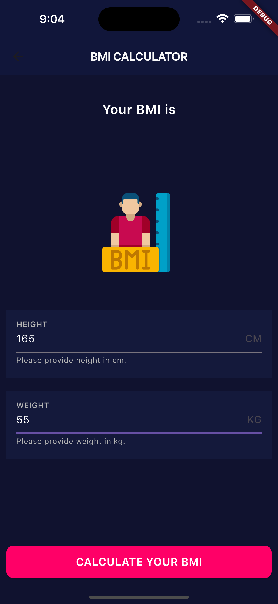
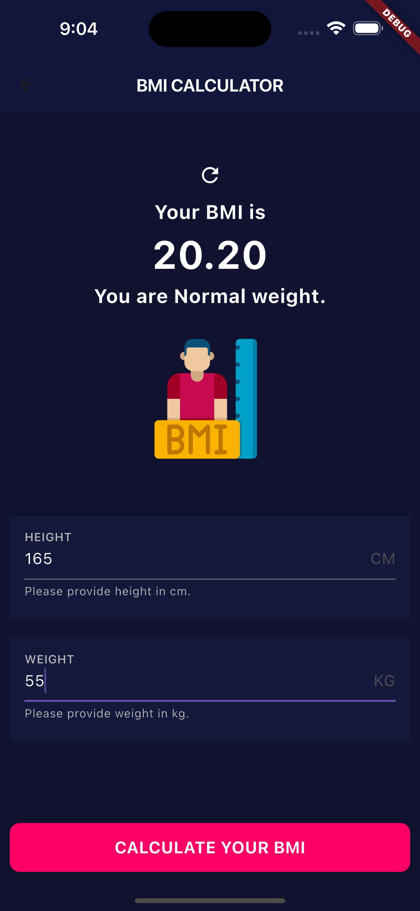
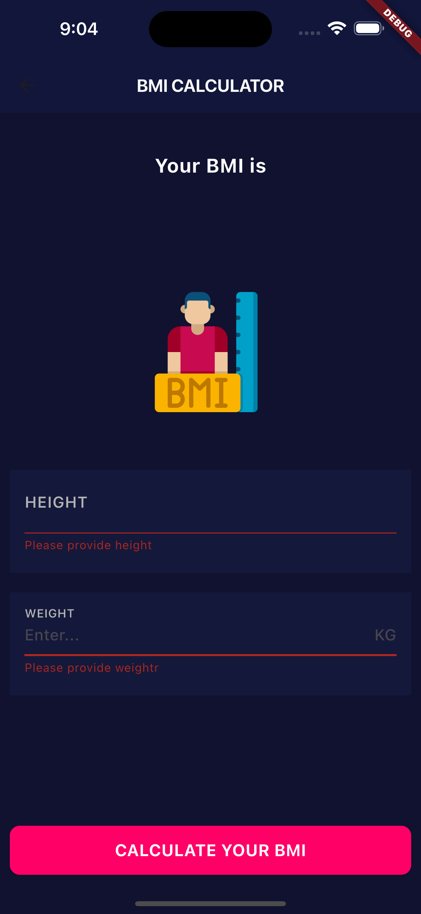

# BMI Calculator

## Overview

The BMI Calculator app allows users to calculate their Body Mass Index (BMI) based on their weight and height. It provides form validation to ensure that required fields are filled and categorizes the BMI into four conditions.

## Features

- **Form Validation**: Validates that both weight and height fields are filled. Displays error messages like "Please provide weight" or "Please provide height" if fields are empty.
- **BMI Calculation**: Computes BMI using the user's weight (kg) and height (cm).
- **BMI Classification**: Shows one of four categories based on the BMI value:
  - Underweight
  - Normal weight
  - Overweight
  - Obesity

## Screenshots

Here are some screenshots of the BMI Calculator app:

<div style="display: flex;  gap: 10px">





</div>


## Screen Recording

Watch the screen recording of the BMI Calculator app:

<video controls src="lib/assets/demos/recording.mp4" title="Title" width="300"></video>

## How to Run the App

1. **Clone the Repository**

   ```sh
   git clone https://github.com/yourusername/bmi_calculator.git
2. **Navigate to the Project Directory**

   ```sh
   cd bmi_calculator
3. **Install Dependencies - Ensure you have Flutter installed, then run:**

   ```sh
   flutter pub get
4. **Run the App**

   ```sh
   flutter run
